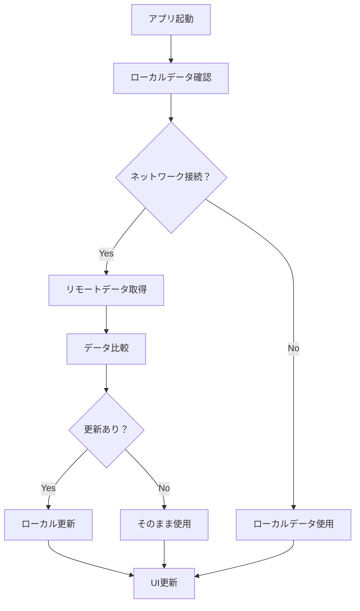

# API統合設計書

## 🌐 バックエンドAPI概要

本アプリケーションは**FastAPI**ベースのバックエンドと連携し、英単語学習に必要なデータを取得・更新します。

### API基本情報

| 項目 | 値 |
|------|-----|
| **ベースURL（開発）** | `http://localhost:8000` |
| **ベースURL（本番）** | `https://your-cloud-run-service-url` |
| **認証方式** | なし（現在）|
| **データ形式** | JSON |
| **エラー形式** | RFC 7807準拠 |
| **API操作** | **読み取り専用** |
| **エンドポイント数** | **3個**（User、Flashcard、Meaning取得のみ） |

## 📊 API エンドポイント詳細

### 1. ユーザー管理API

#### 1.1 ユーザー情報取得
```http
GET /user/{userId}
```

**パラメータ:**
- `userId` (string): ユーザーID

**レスポンス例:**
```json
{
  "message": "User retrieved successfully",
  "user": {
    "userId": "cergU7H1N7gRnzZmiZcC",
    "email": "yamada@yamada.com",
    "userName": "山田",
    "flashcardIdList": [
      "U0R53LJvpZOCdvVDbUYF",
      "iota2j31aw9opZXXEQAy"
    ]
  }
}
```

**Flutter実装:**
```dart
Future<Result<User>> getUser(String userId) async {
  try {
    final response = await _httpClient.get<Map<String, dynamic>>(
      ApiEndpoints.userById(userId),
    );

    final userResponse = UserResponse.fromJson(response.data!);
    final user = User.fromJson(userResponse.user);
    
    return Ok(user);
  } on AppException catch (e) {
    return Error(e);
  }
}
```

#### 1.2 ユーザー登録
```http
POST /user/setup
```

**リクエストボディ:**
```json
{
  "userId": "12345",
  "email": "yamada@yamada.com",
  "userName": "山田"
}
```

**レスポンス:**
```json
{
  "message": "User setup successful"
}
```

#### 1.3 ユーザー情報更新
```http
PUT /user/update
```

**リクエストボディ:**
```json
{
  "userId": "cergU7H1N7gRnzZmiZcC",
  "email": "yamada@yamada.com",
  "userName": "山田2"
}
```

#### 1.4 ユーザー削除
```http
DELETE /user/{userId}
```

### 2. フラッシュカード管理API

#### 2.1 フラッシュカード一覧取得
```http
GET /flashcard/{userId}
```

**レスポンス例:**
```json
{
  "message": "Flashcards retrieved successfully",
  "flashcards": [
    {
      "flashcardId": "U0R53LJvpZOCdvVDbUYF",
      "wordId": "word123",
      "word": "example",
      "checkFlag": false,
      "memo": "学習メモ",
      "usingMeaningIdList": ["meaning1", "meaning2"],
      "mediaUrls": ["https://storage.googleapis.com/bucket/image1.jpg"],
      "currentMediaId": "media456"
    }
  ]
}
```

**Flutter実装:**
```dart
Future<Result<List<Flashcard>>> getUserFlashcards(String userId) async {
  try {
    final response = await _httpClient.get<Map<String, dynamic>>(
      ApiEndpoints.flashcardByUserId(userId),
    );

    final flashcardsResponse = FlashcardsResponse.fromJson(response.data!);
    final flashcards = flashcardsResponse.flashcards
        .map(Flashcard.fromJson)
        .toList();
    
    return Ok(flashcards);
  } on AppException catch (e) {
    return Error(e);
  }
}
```

#### 2.2 学習状態更新
```http
PUT /flashcard/update/checkFlag
```

**リクエストボディ:**
```json
{
  "flashcardId": "U0R53LJvpZOCdvVDbUYF",
  "checkFlag": true
}
```

#### 2.3 メモ更新
```http
PUT /flashcard/update/memo
```

**リクエストボディ:**
```json
{
  "flashcardId": "U0R53LJvpZOCdvVDbUYF",
  "memo": "更新されたメモ内容"
}
```

#### 2.4 使用意味ID更新
```http
PUT /flashcard/update/usingMeaningIdList
```

**リクエストボディ:**
```json
{
  "flashcardId": "U0R53LJvpZOCdvVDbUYF",
  "usingMeaningIdList": ["L35JDrI7sVIrkhxNulsE"]
}
```

### 3. 意味情報API

#### 3.1 単語の意味取得
```http
GET /meaning/{wordId}
```

**レスポンス例:**
```json
{
  "message": "Meanings retrieved successfully",
  "meanings": [
    {
      "meaningId": "meaning_123",
      "pos": "noun",
      "definition": "a small domesticated carnivorous mammal",
      "translation": "猫",
      "exampleEng": "The cat sat on the mat.",
      "exampleJpn": "猫がマットの上に座った。",
      "explanation": "一般的にペットとして飼われる小型の哺乳類"
    }
  ]
}
```

### 4. メディア生成API

#### 4.1 メディア生成
```http
POST /media/create
```

**リクエストボディ:**
```json
{
  "flashcardId": "12345",
  "oldMediaId": "67890",
  "meaningId": "54321",
  "pos": "noun",
  "word": "cat",
  "translation": "猫",
  "exampleJpn": "猫がマットの上に座っていました。",
  "explanation": "しばしば犬と対比される小型の哺乳類",
  "generationType": "text-to-image",
  "templateId": "template_001",
  "userPrompt": "画像生成プロンプト...",
  "otherSettings": ["猫の種類は三毛猫にしてください。"],
  "allowGeneratingPerson": true
}
```

## 🔧 HTTP クライアント設定

### Dio設定
```dart
class HttpClient {
  late final Dio _dio;

  HttpClient() {
    _dio = Dio(BaseOptions(
      baseUrl: AppConfig.environment.baseUrl,
      connectTimeout: const Duration(seconds: 30),
      receiveTimeout: const Duration(seconds: 30),
      headers: {
        'Content-Type': 'application/json',
        'Accept': 'application/json',
      },
    ));

    _setupInterceptors();
  }
}
```

### インターセプター
```dart
void _setupInterceptors() {
  // ログ出力
  if (AppConfig.isDebug) {
    _dio.interceptors.add(LogInterceptor(
      request: true,
      requestHeader: true,
      requestBody: true,
      responseBody: true,
      error: true,
    ));
  }

  // リクエスト/レスポンス処理
  _dio.interceptors.add(InterceptorsWrapper(
    onRequest: (options, handler) {
      // 認証ヘッダー追加（将来実装）
      handler.next(options);
    },
    onError: (error, handler) {
      // エラーハンドリング
      handler.next(error);
    },
  ));
}
```

## 🛡️ エラーハンドリング

### HTTP ステータスコード対応

| ステータス | 意味 | Flutter例外 |
|-----------|------|------------|
| **200** | 成功 | - |
| **400** | リクエストエラー | `ApiException` |
| **401** | 認証エラー | `AuthException` |
| **404** | リソース未発見 | `ApiException` |
| **422** | バリデーションエラー | `ValidationException` |
| **500** | サーバーエラー | `ApiException` |

### エラーレスポンス形式
```json
{
  "detail": "エラーメッセージ"
}
```

### Flutter エラーハンドリング
```dart
AppException _handleDioException(DioException e) {
  switch (e.type) {
    case DioExceptionType.connectionTimeout:
    case DioExceptionType.sendTimeout:
    case DioExceptionType.receiveTimeout:
      return const NetworkException('接続がタイムアウトしました');
    
    case DioExceptionType.badResponse:
      final statusCode = e.response?.statusCode;
      final data = e.response?.data;
      final message = (data is Map<String, dynamic>) 
          ? (data['detail'] as String? ?? 'サーバーエラーが発生しました')
          : 'サーバーエラーが発生しました';
      
      if (statusCode == 401) {
        return AuthException(message, statusCode?.toString());
      } else if (statusCode == 422) {
        return ValidationException(message, statusCode?.toString());
      } else {
        return ApiException(message, statusCode?.toString());
      }
    
    case DioExceptionType.connectionError:
      return const NetworkException('ネットワーク接続エラーが発生しました');
    
    default:
      return NetworkException('不明なエラーが発生しました: ${e.message}');
  }
}
```

## 💾 キャッシュ戦略

### ローカルキャッシュ
- **SharedPreferences**: メタデータ・設定情報
- **Repository Pattern**: 自動キャッシュ・同期

### キャッシュ実装例
```dart
@override
Future<Result<List<Flashcard>>> getUserFlashcards(String userId) async {
  // 1. ローカルキャッシュ確認
  final cachedResult = await _localRepository.getCachedFlashcards(userId);
  
  // 2. リモートデータ取得
  final remoteResult = await _remoteRepository.getUserFlashcards(userId);
  
  return switch (remoteResult) {
    Ok(data: final flashcards) => {
      // 3. キャッシュ更新
      await _localRepository.cacheFlashcards(userId, flashcards),
      Ok(flashcards)
    },
    Error() => switch (cachedResult) {
      Ok(data: final cached) when cached.isNotEmpty => Ok(cached),
      _ => remoteResult,
    },
  };
}
```

## 🔄 データ同期

### 同期フロー


### バックグラウンド同期
```dart
class SyncService {
  static Future<void> backgroundSync() async {
    final userId = await AuthService.getCurrentUserId();
    if (userId == null) return;

    try {
      // フラッシュカード同期
      await _flashcardRepository.syncWithRemote(userId);
      
      // ユーザー情報同期
      await _userRepository.syncWithRemote(userId);
      
    } catch (e) {
      // エラーログ記録
      Logger.e('Background sync failed: $e');
    }
  }
}
```

## 🔐 認証・セキュリティ

### 現在の認証方式
- **ユーザーID**ベース認証
- **ローカル セッション管理**

### 将来の認証拡張
```dart
// 将来実装予定
class AuthInterceptor extends Interceptor {
  @override
  void onRequest(RequestOptions options, RequestInterceptorHandler handler) {
    final token = AuthService.getAuthToken();
    if (token != null) {
      options.headers['Authorization'] = 'Bearer $token';
    }
    handler.next(options);
  }
}
```

## 📈 パフォーマンス最適化

### リクエスト最適化
1. **並列リクエスト**: 複数APIの同時実行
2. **リクエストキューイング**: 順次実行制御
3. **タイムアウト設定**: 適切な待機時間

### レスポンス最適化
1. **データページング**: 大量データの分割取得
2. **差分更新**: 変更分のみ取得
3. **圧縮**: gzip対応

### 実装例
```dart
// 並列データ取得
Future<void> loadInitialData(String userId) async {
  final futures = await Future.wait([
    _userRepository.getUser(userId),
    _flashcardRepository.getUserFlashcards(userId),
  ]);
  
  // 結果処理
  // ...
}
```

## 🧪 テスト戦略

### API テスト
```dart
group('FlashcardApiService', () {
  late MockHttpClient mockHttpClient;
  late FlashcardApiService apiService;

  setUp(() {
    mockHttpClient = MockHttpClient();
    apiService = FlashcardApiService(mockHttpClient);
  });

  test('should return flashcards when API call is successful', () async {
    // Arrange
    when(() => mockHttpClient.get<Map<String, dynamic>>(any()))
        .thenAnswer((_) async => Response(
          data: {'flashcards': []},
          statusCode: 200,
          requestOptions: RequestOptions(path: ''),
        ));

    // Act
    final result = await apiService.getUserFlashcards('userId');

    // Assert
    expect(result.isOk, true);
  });
});
```

## 📊 監視・ログ

### API レスポンス監視
```dart
class ApiMetrics {
  static void recordApiCall(String endpoint, Duration duration, bool success) {
    // メトリクス記録
    Logger.i('API Call: $endpoint, Duration: ${duration.inMilliseconds}ms, Success: $success');
  }
}
```

### エラー追跡
```dart
class ErrorTracker {
  static void trackApiError(String endpoint, AppException error) {
    // エラー追跡サービスに送信（Firebase Crashlytics等）
    Logger.e('API Error: $endpoint, Error: ${error.message}');
  }
}
```

---

**この設計により、堅牢で効率的なAPI統合を実現し、優れたユーザーエクスペリエンスを提供します。**