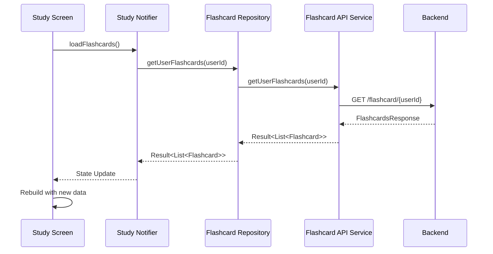

# アーキテクチャ設計書

## 🏗️ Clean Architecture概要

本プロジェクトは**Clean Architecture**と**MVVM**パターンを組み合わせて設計されています。

### アーキテクチャ図

```
┌─────────────────────────────────────────────────────────────┐
│                        UI Layer                             │
│  ┌─────────────────┐  ┌─────────────────┐  ┌─────────────────┐ │
│  │   Auth Screen   │  │  Study Screen   │  │   List Screen   │ │
│  └─────────────────┘  └─────────────────┘  └─────────────────┘ │
│                             │                               │
│  ┌─────────────────┐  ┌─────────────────┐  ┌─────────────────┐ │
│  │  Auth Notifier  │  │ Study Notifier  │  │  List Notifier  │ │
│  │   (StateNotifier)│  │   (StateNotifier)│  │   (StateNotifier)│ │
│  └─────────────────┘  └─────────────────┘  └─────────────────┘ │
└─────────────────────────────────────────────────────────────┘
                                │
                     ┌─────────────────┐
                     │   Riverpod DI   │
                     └─────────────────┘
                                │
┌─────────────────────────────────────────────────────────────┐
│                     Data Layer                              │
│  ┌─────────────────┐  ┌─────────────────┐  ┌─────────────────┐ │
│  │ User Repository │  │Flashcard Repo   │  │Meaning Repo     │ │
│  │ (Interface)     │  │ (Interface)     │  │ (Interface)     │ │
│  └─────────────────┘  └─────────────────┘  └─────────────────┘ │
│           │                     │                     │     │
│  ┌─────────────────┐  ┌─────────────────┐  ┌─────────────────┐ │
│  │   Remote Impl   │  │   Remote Impl   │  │   Remote Impl   │ │
│  │   Local Impl    │  │   Local Impl    │  │   Local Impl    │ │
│  └─────────────────┘  └─────────────────┘  └─────────────────┘ │
│           │                     │                     │     │
│  ┌─────────────────┐  ┌─────────────────┐  ┌─────────────────┐ │
│  │  API Service    │  │  API Service    │  │  API Service    │ │
│  └─────────────────┘  └─────────────────┘  └─────────────────┘ │
└─────────────────────────────────────────────────────────────┘
                                │
┌─────────────────────────────────────────────────────────────┐
│                    Domain Layer                             │
│  ┌─────────────────┐  ┌─────────────────┐  ┌─────────────────┐ │
│  │   User Model    │  │ Flashcard Model │  │  Meaning Model  │ │
│  │   (Freezed)     │  │   (Freezed)     │  │   (Freezed)     │ │
│  └─────────────────┘  └─────────────────┘  └─────────────────┘ │
│                                                             │
│  ┌─────────────────┐  ┌─────────────────┐  ┌─────────────────┐ │
│  │   Enums         │  │   Exceptions    │  │   Utils         │ │
│  └─────────────────┘  └─────────────────┘  └─────────────────┘ │
└─────────────────────────────────────────────────────────────┘
```

## 📁 ディレクトリ構造詳細

### `/lib/domain/` - ドメイン層
**責務**: ビジネスロジックとエンティティの定義

```
domain/
├── models/
│   ├── user/
│   │   ├── user.dart              # Userエンティティ
│   │   ├── user.freezed.dart      # 生成ファイル
│   │   └── user.g.dart           # JSON生成ファイル
│   ├── flashcard/
│   │   ├── flashcard.dart        # Flashcardエンティティ
│   │   ├── flashcard.freezed.dart
│   │   └── flashcard.g.dart
│   ├── meaning/
│   │   ├── meaning.dart          # Meaningエンティティ
│   │   ├── meaning.freezed.dart
│   │   └── meaning.g.dart
│   └── common/
│       ├── api_response.dart     # 共通レスポンスモデル
│       └── enums.dart           # 列挙型定義
```

**特徴**:
- **Freezed**によるイミュータブルなデータクラス
- **JSON Serializable**による自動シリアライゼーション
- **ビジネスルール**の封じ込め

### `/lib/data/` - データアクセス層
**責務**: 外部データソースとの通信

```
data/
├── services/                      # API通信サービス
│   ├── http_client.dart          # HTTP基盤クライアント
│   ├── user_api_service.dart     # ユーザーAPI
│   ├── flashcard_api_service.dart # フラッシュカードAPI
│   ├── meaning_api_service.dart  # 意味API
│   └── providers.dart            # Riverpodプロバイダー
└── repositories/                  # リポジトリ実装
    ├── user/
    │   ├── user_repository.dart         # インターフェース
    │   ├── user_repository_remote.dart  # リモート実装
    │   └── user_repository_local.dart   # ローカル実装
    ├── flashcard/
    │   ├── flashcard_repository.dart
    │   ├── flashcard_repository_remote.dart
    │   └── flashcard_repository_local.dart
    ├── meaning/
    │   └── meaning_repository.dart
    └── providers.dart             # Riverpodプロバイダー
```

**設計パターン**:
- **Repository Pattern**: データソースの抽象化
- **Strategy Pattern**: Local/Remote実装の切り替え
- **Result Pattern**: エラーハンドリングの統一

### `/lib/ui/` - プレゼンテーション層
**責務**: ユーザーインターフェースとインタラクション

```
ui/
├── auth/                          # 認証関連画面
│   ├── notifiers/
│   │   └── auth_notifier.dart    # 認証状態管理
│   └── widgets/
│       ├── login_screen.dart     # ログイン画面
│       └── signup_screen.dart    # サインアップ画面
├── study/                         # スワイプ学習画面
│   ├── notifiers/
│   │   └── study_notifier.dart   # 学習状態管理
│   └── widgets/
│       ├── study_screen.dart     # メイン学習画面
│       ├── swipe_card.dart       # スワイプカードWidget
│       └── progress_indicator.dart # 進捗表示
├── card_list/                     # カード一覧画面
│   ├── notifiers/
│   │   └── card_list_notifier.dart
│   └── widgets/
│       ├── card_list_screen.dart
│       ├── card_item.dart
│       └── search_bar.dart
├── shared/                        # 共通UIコンポーネント
│   ├── loading_widget.dart
│   ├── error_widget.dart
│   └── common_button.dart
└── home/                          # ホーム画面
    ├── notifiers/
    │   └── home_notifier.dart
    └── widgets/
        └── home_screen.dart
```

**MVVMパターン**:
- **View**: Widgetクラス（UIの描画）
- **ViewModel**: StateNotifier（状態管理・ビジネスロジック）
- **Model**: Domainエンティティ（データ構造）

### `/lib/core/` - 共通基盤
**責務**: アプリケーション全体で使用される共通機能

```
core/
├── constants/
│   ├── api_endpoints.dart        # API エンドポイント定義
│   └── app_config.dart          # アプリケーション設定
├── exceptions/
│   └── app_exception.dart       # カスタム例外定義
├── utils/
│   └── result.dart              # Result型定義
└── services/
    └── auth_service.dart        # 認証サービス
```

## 🔄 データフロー

### 1. ユーザーアクション発生
```
User Tap/Swipe → Widget → Notifier
```

### 2. 状態更新・API呼び出し
```
Notifier → Repository → API Service → Backend
```

### 3. レスポンス処理
```
Backend → API Service → Repository → Notifier → Widget Update
```

### 詳細フロー例：フラッシュカード取得



## 🔧 依存性注入（Riverpod）

### プロバイダー階層

```dart
// 基盤レイヤー
sharedPreferencesProvider
httpClientProvider

// APIサービスレイヤー
userApiServiceProvider
flashcardApiServiceProvider
meaningApiServiceProvider

// リポジトリレイヤー
userRepositoryProvider
flashcardRepositoryProvider
meaningRepositoryProvider

// アプリケーションレイヤー
authServiceProvider
studyNotifierProvider
cardListNotifierProvider
```

### 依存関係の解決

```dart
final studyNotifierProvider = StateNotifierProvider<StudyNotifier, StudyState>((ref) {
  return StudyNotifier(
    flashcardRepository: ref.watch(flashcardRepositoryProvider),
    authService: ref.watch(authServiceProvider),
  );
});
```

## 🎯 状態管理戦略

### StateNotifier パターン

```dart
class StudyNotifier extends StateNotifier<StudyState> {
  StudyNotifier({
    required this.flashcardRepository,
    required this.authService,
  }) : super(const StudyState.initial());

  final FlashcardRepository flashcardRepository;
  final AuthService authService;

  Future<void> loadFlashcards() async {
    state = const StudyState.loading();
    
    final result = await flashcardRepository.getUserFlashcards(userId);
    
    state = switch (result) {
      Ok(data: final flashcards) => StudyState.loaded(flashcards),
      Error(exception: final e) => StudyState.error(e.message),
    };
  }
}
```

### 状態の種類

```dart
@freezed
class StudyState with _$StudyState {
  const factory StudyState.initial() = _Initial;
  const factory StudyState.loading() = _Loading;
  const factory StudyState.loaded(List<Flashcard> flashcards) = _Loaded;
  const factory StudyState.error(String message) = _Error;
}
```

## 🛡️ エラーハンドリング戦略

### Result Pattern

```dart
sealed class Result<T> {
  const Result();
}

class Ok<T> extends Result<T> {
  const Ok(this.data);
  final T data;
}

class Error<T> extends Result<T> {
  const Error(this.exception);
  final AppException exception;
}
```

### 例外階層

```dart
abstract class AppException implements Exception {
  const AppException(this.message, [this.code]);
  final String message;
  final String? code;
}

class NetworkException extends AppException { /* ... */ }
class ApiException extends AppException { /* ... */ }
class AuthException extends AppException { /* ... */ }
class DataException extends AppException { /* ... */ }
class StorageException extends AppException { /* ... */ }
class ValidationException extends AppException { /* ... */ }
```

## 🚀 パフォーマンス最適化

### 1. 効率的な再描画
- **Riverpod**による最小限の状態更新
- **select**メソッドによる部分的な状態監視

### 2. データキャッシュ戦略
- **Local Repository**による永続化
- **SharedPreferences**でのメタデータキャッシュ
- **自動同期**とオフライン対応

### 3. UI最適化
- **const Constructor**による不変Widget
- **ValueKey**による効率的なWidget再利用
- **遅延読み込み**とページング

## 🧪 テスト戦略

### テスト層構造

```
test/
├── unit/                          # ユニットテスト
│   ├── domain/                    # ドメインロジック
│   ├── data/                      # リポジトリ・API
│   └── core/                      # ユーティリティ
├── widget/                        # ウィジェットテスト
│   ├── auth/
│   ├── study/
│   └── shared/
└── integration/                   # 統合テスト
    └── app_flow_test.dart
```

### テスト可能性
- **依存性注入**による容易なモック化
- **Repository Pattern**によるデータソース分離
- **Pure Function**による予測可能な動作

## 📈 スケーラビリティ

### 水平拡張
- **機能別モジュール化**による独立した開発
- **プラガブルアーキテクチャ**による機能追加
- **マイクロフロントエンド**アプローチ

### 垂直拡張  
- **非同期処理**の最適化
- **メモリ効率**の向上
- **バックエンド負荷分散**

---

**この設計により、保守性・テスト性・拡張性を兼ね備えた高品質なアプリケーションを構築します。**