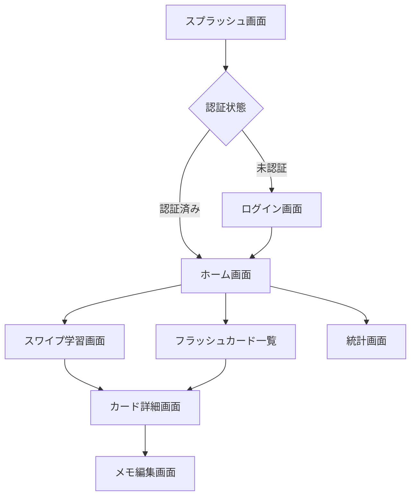

# UI設計・スワイプ機能仕様書

## 🎨 全体デザインシステム

### Material 3 Design System
本アプリケーションは**Material 3**を採用し、モダンで直感的なUIを提供します。

#### カラーパレット
```dart
// Primary Colors
const primaryColor = Color(0xFF6750A4);
const primaryVariant = Color(0xFF21005D);
const onPrimary = Color(0xFFFFFFFF);

// Secondary Colors
const secondaryColor = Color(0xFF625B71);
const onSecondary = Color(0xFFFFFFFF);

// Surface Colors
const surface = Color(0xFFFFFBFE);
const onSurface = Color(0xFF1C1B1F);
const surfaceVariant = Color(0xFFE7E0EC);

// Learning Status Colors
const masteredColor = Color(0xFF4CAF50);    // Green
const learningColor = Color(0xFFFF9800);    // Orange
const notStudiedColor = Color(0xFF9E9E9E);  // Grey
```

#### タイポグラフィ
```dart
// Headline
headline1: GoogleFonts.notoSans(fontSize: 32, fontWeight: FontWeight.w400),
headline2: GoogleFonts.notoSans(fontSize: 24, fontWeight: FontWeight.w400),

// Body Text
bodyText1: GoogleFonts.notoSans(fontSize: 16, fontWeight: FontWeight.w400),
bodyText2: GoogleFonts.notoSans(fontSize: 14, fontWeight: FontWeight.w400),

// Button
button: GoogleFonts.notoSans(fontSize: 14, fontWeight: FontWeight.w500),
```

## 📱 画面構成概要

### アプリケーション全体フロー


### 主要画面一覧

| 画面名 | 役割 | 優先度 |
|--------|------|--------|
| **スワイプ学習画面** | メイン機能 - カードスワイプ学習 | 🔥 最高 |
| **ホーム画面** | ダッシュボード・ナビゲーション | 🔥 高 |
| **フラッシュカード一覧** | カード管理・選択 | 🔥 高 |
| **認証画面** | ログイン・サインアップ | 🔥 高 |
| **カード詳細画面** | 詳細情報・編集 | 📝 中 |
| **統計画面** | 学習進捗・分析 | 📊 中 |

## 🃏 スワイプ学習画面（メイン機能）

### 画面レイアウト

```
┌─────────────────────────────────────┐
│              Top Bar                │ ← 進捗表示・設定ボタン
├─────────────────────────────────────┤
│                                     │
│         Card Stack Area             │ ← メインカードスタック
│                                     │
│    ┌─────────────────────────┐      │
│    │                         │      │
│    │      Current Card       │      │ ← 現在のカード
│    │                         │      │
│    └─────────────────────────┘      │
│                                     │
│              Swipe Zone             │ ← スワイプジェスチャーエリア
│                                     │
├─────────────────────────────────────┤
│     Action Buttons (Optional)       │ ← 補助ボタン
├─────────────────────────────────────┤
│           Bottom Bar                │ ← ナビゲーション
└─────────────────────────────────────┘
```

### スワイプジェスチャー仕様

#### 1. スワイプ方向と動作

| スワイプ方向 | 動作 | 視覚フィードバック | API呼び出し |
|-------------|------|------------------|------------|
| **右スワイプ** | 「覚えた」 | 緑色のオーバーレイ + ✓アイコン | `checkFlag: true` |
| **左スワイプ** | 「覚えていない」 | 赤色のオーバーレイ + ✗アイコン | `checkFlag: false` |
| **上スワイプ** | 詳細表示 | カード拡大アニメーション | なし |
| **下スワイプ** | スキップ | グレーのオーバーレイ + ↓アイコン | なし |

#### 2. スワイプ閾値設定
```dart
class SwipeThresholds {
  static const double horizontalThreshold = 100.0;  // 水平方向の最小移動距離
  static const double verticalThreshold = 80.0;     // 垂直方向の最小移動距離
  static const double velocityThreshold = 500.0;    // 最小速度（px/秒）
  static const double rotationAngle = 0.3;          // カード回転角度（ラジアン）
}
```

#### 3. アニメーション仕様
```dart
class CardAnimations {
  // スワイプ中のアニメーション
  static const Duration swipeDuration = Duration(milliseconds: 300);
  static const Curve swipeCurve = Curves.easeOutCubic;
  
  // カード出現アニメーション
  static const Duration cardEnterDuration = Duration(milliseconds: 500);
  static const Curve cardEnterCurve = Curves.elasticOut;
  
  // 戻るアニメーション
  static const Duration snapBackDuration = Duration(milliseconds: 200);
  static const Curve snapBackCurve = Curves.easeInOut;
}
```

### カードUI詳細設計

#### カードコンポーネント構造
```dart
class FlashcardWidget extends StatelessWidget {
  @override
  Widget build(BuildContext context) {
    return Container(
      width: 300,
      height: 400,
      decoration: BoxDecoration(
        borderRadius: BorderRadius.circular(16),
        boxShadow: [
          BoxShadow(
            color: Colors.black.withOpacity(0.1),
            blurRadius: 10,
            offset: const Offset(0, 4),
          ),
        ],
      ),
      child: Card(
        child: Column(
          children: [
            // 画像エリア (40%)
            Expanded(
              flex: 4,
              child: MediaSection(),
            ),
            // 単語・意味エリア (60%)
            Expanded(
              flex: 6,
              child: ContentSection(),
            ),
          ],
        ),
      ),
    );
  }
}
```

#### カード表面（Front）
```
┌─────────────────────────────────────┐
│                                     │
│         Generated Image             │ ← AI生成画像
│           (Optional)                │
│                                     │
├─────────────────────────────────────┤
│                                     │
│        English Word                 │ ← 英単語 (大きなフォント)
│         "example"                   │
│                                     │
│        Part of Speech               │ ← 品詞 (小さなフォント)
│           "noun"                    │
│                                     │
│     Progress Indicator              │ ← 学習進捗
│        ● ● ○ ○ ○                    │
│                                     │
└─────────────────────────────────────┘
```

#### カード裏面（Back）/ 詳細表示
```
┌─────────────────────────────────────┐
│     Japanese Translation            │ ← 日本語訳
│          "例、模範"                   │
├─────────────────────────────────────┤
│        Definition                   │ ← 英語定義
│   "a thing characteristic of..."    │
├─────────────────────────────────────┤
│      Example Sentence               │ ← 例文
│  "This is an example sentence."     │
│  「これは例文です。」                  │
├─────────────────────────────────────┤
│        Explanation                  │ ← 詳細説明
│   「実例や見本として示される...」        │
├─────────────────────────────────────┤
│         User Memo                   │ ← ユーザーメモ
│    "個人的なメモ内容..."              │
└─────────────────────────────────────┘
```

### スワイプ実装詳細

#### GestureDetector実装
```dart
class SwipeCardWidget extends StatefulWidget {
  @override
  _SwipeCardWidgetState createState() => _SwipeCardWidgetState();
}

class _SwipeCardWidgetState extends State<SwipeCardWidget>
    with TickerProviderStateMixin {
  late AnimationController _animationController;
  late Animation<Offset> _slideAnimation;
  late Animation<double> _rotationAnimation;
  late Animation<double> _scaleAnimation;

  Offset _dragOffset = Offset.zero;
  bool _isDragging = false;

  @override
  void initState() {
    super.initState();
    _setupAnimations();
  }

  void _setupAnimations() {
    _animationController = AnimationController(
      duration: CardAnimations.swipeDuration,
      vsync: this,
    );

    _slideAnimation = Tween<Offset>(
      begin: Offset.zero,
      end: Offset.zero, // 動的に設定
    ).animate(CurvedAnimation(
      parent: _animationController,
      curve: CardAnimations.swipeCurve,
    ));

    _rotationAnimation = Tween<double>(
      begin: 0.0,
      end: 0.0, // 動的に設定
    ).animate(_animationController);

    _scaleAnimation = Tween<double>(
      begin: 1.0,
      end: 0.8,
    ).animate(_animationController);
  }

  @override
  Widget build(BuildContext context) {
    return GestureDetector(
      onPanStart: _onPanStart,
      onPanUpdate: _onPanUpdate,
      onPanEnd: _onPanEnd,
      child: AnimatedBuilder(
        animation: _animationController,
        builder: (context, child) {
          final offset = _isDragging ? _dragOffset : _slideAnimation.value;
          final rotation = _isDragging 
              ? _dragOffset.dx * SwipeThresholds.rotationAngle / 200
              : _rotationAnimation.value;

          return Transform.translate(
            offset: offset,
            child: Transform.rotate(
              angle: rotation,
              child: Transform.scale(
                scale: _scaleAnimation.value,
                child: _buildCard(),
              ),
            ),
          );
        },
      ),
    );
  }

  void _onPanStart(DragStartDetails details) {
    _isDragging = true;
    _animationController.stop();
  }

  void _onPanUpdate(DragUpdateDetails details) {
    setState(() {
      _dragOffset += details.delta;
    });
    
    // リアルタイムフィードバック
    _updateSwipeFeedback();
  }

  void _onPanEnd(DragEndDetails details) {
    _isDragging = false;
    
    final velocity = details.velocity.pixelsPerSecond;
    final deltaX = _dragOffset.dx;
    final deltaY = _dragOffset.dy;
    
    // スワイプ判定
    if (_shouldTriggerSwipe(deltaX, deltaY, velocity)) {
      _executeSwipe(_getSwipeDirection(deltaX, deltaY));
    } else {
      _snapBack();
    }
  }

  bool _shouldTriggerSwipe(double deltaX, double deltaY, Offset velocity) {
    return deltaX.abs() > SwipeThresholds.horizontalThreshold ||
           deltaY.abs() > SwipeThresholds.verticalThreshold ||
           velocity.distance > SwipeThresholds.velocityThreshold;
  }

  SwipeDirection _getSwipeDirection(double deltaX, double deltaY) {
    if (deltaX.abs() > deltaY.abs()) {
      return deltaX > 0 ? SwipeDirection.right : SwipeDirection.left;
    } else {
      return deltaY > 0 ? SwipeDirection.down : SwipeDirection.up;
    }
  }

  void _executeSwipe(SwipeDirection direction) {
    // アニメーション設定
    _slideAnimation = Tween<Offset>(
      begin: _dragOffset,
      end: _getSwipeEndOffset(direction),
    ).animate(_animationController);

    // スワイプ実行
    _animationController.forward().then((_) {
      _handleSwipeComplete(direction);
    });
  }

  void _snapBack() {
    _slideAnimation = Tween<Offset>(
      begin: _dragOffset,
      end: Offset.zero,
    ).animate(_animationController);

    _animationController.forward().then((_) {
      _resetCard();
    });
  }
}
```

#### スワイプフィードバック
```dart
class SwipeFeedbackWidget extends StatelessWidget {
  final SwipeDirection? direction;
  final double intensity; // 0.0 - 1.0

  @override
  Widget build(BuildContext context) {
    if (direction == null || intensity < 0.2) return const SizedBox();

    return AnimatedOpacity(
      opacity: intensity,
      duration: const Duration(milliseconds: 100),
      child: Container(
        decoration: BoxDecoration(
          color: _getFeedbackColor(direction!).withOpacity(0.8),
          borderRadius: BorderRadius.circular(16),
        ),
        child: Center(
          child: Column(
            mainAxisSize: MainAxisSize.min,
            children: [
              Icon(
                _getFeedbackIcon(direction!),
                size: 60,
                color: Colors.white,
              ),
              const SizedBox(height: 8),
              Text(
                _getFeedbackText(direction!),
                style: const TextStyle(
                  color: Colors.white,
                  fontSize: 18,
                  fontWeight: FontWeight.bold,
                ),
              ),
            ],
          ),
        ),
      ),
    );
  }

  Color _getFeedbackColor(SwipeDirection direction) {
    switch (direction) {
      case SwipeDirection.right:
        return const Color(0xFF4CAF50); // Green
      case SwipeDirection.left:
        return const Color(0xFFF44336); // Red
      case SwipeDirection.up:
        return const Color(0xFF2196F3); // Blue
      case SwipeDirection.down:
        return const Color(0xFF9E9E9E); // Grey
    }
  }

  IconData _getFeedbackIcon(SwipeDirection direction) {
    switch (direction) {
      case SwipeDirection.right:
        return Icons.check_circle;
      case SwipeDirection.left:
        return Icons.cancel;
      case SwipeDirection.up:
        return Icons.info;
      case SwipeDirection.down:
        return Icons.skip_next;
    }
  }

  String _getFeedbackText(SwipeDirection direction) {
    switch (direction) {
      case SwipeDirection.right:
        return '覚えた！';
      case SwipeDirection.left:
        return 'もう一度';
      case SwipeDirection.up:
        return '詳細表示';
      case SwipeDirection.down:
        return 'スキップ';
    }
  }
}
```

## 📋 フラッシュカード一覧画面

### レイアウト設計
```
┌─────────────────────────────────────┐
│         App Bar                     │
│  📚 フラッシュカード  [🔍] [⚙️]      │
├─────────────────────────────────────┤
│      Search & Filter Bar            │
│  [検索ボックス] [フィルター] [表示切替] │
├─────────────────────────────────────┤
│                                     │
│         Card Grid/List              │
│                                     │
│  ┌─────┐ ┌─────┐ ┌─────┐ ┌─────┐    │
│  │Card │ │Card │ │Card │ │Card │    │
│  │ 🟢  │ │ 🔴  │ │ ⚪  │ │ 🟡  │    │
│  └─────┘ └─────┘ └─────┘ └─────┘    │
│                                     │
│  ┌─────┐ ┌─────┐ ┌─────┐ ┌─────┐    │
│  │Card │ │Card │ │Card │ │Card │    │
│  └─────┘ └─────┘ └─────┘ └─────┘    │
│                                     │
├─────────────────────────────────────┤
│         Bottom Navigation           │
└─────────────────────────────────────┘
```

### カードアイテム設計
```dart
class FlashcardListItem extends StatelessWidget {
  final Flashcard flashcard;
  final VoidCallback onTap;

  @override
  Widget build(BuildContext context) {
    return Card(
      margin: const EdgeInsets.symmetric(horizontal: 16, vertical: 4),
      child: ListTile(
        leading: CircleAvatar(
          backgroundColor: _getStatusColor(flashcard.checkFlag),
          child: Icon(
            _getStatusIcon(flashcard.checkFlag),
            color: Colors.white,
          ),
        ),
        title: Text(
          flashcard.word,
          style: Theme.of(context).textTheme.titleMedium,
        ),
        subtitle: Column(
          crossAxisAlignment: CrossAxisAlignment.start,
          children: [
            Text(_getMeaningPreview(flashcard)),
            if (flashcard.memo.isNotEmpty)
              Text(
                flashcard.memo,
                style: TextStyle(
                  color: Colors.grey[600],
                  fontStyle: FontStyle.italic,
                ),
                maxLines: 1,
                overflow: TextOverflow.ellipsis,
              ),
          ],
        ),
        trailing: Row(
          mainAxisSize: MainAxisSize.min,
          children: [
            if (flashcard.mediaUrls?.isNotEmpty == true)
              const Icon(Icons.image, size: 16),
            const SizedBox(width: 4),
            Icon(Icons.chevron_right),
          ],
        ),
        onTap: onTap,
      ),
    );
  }
}
```

## 🏠 ホーム画面

### ダッシュボード設計
```
┌─────────────────────────────────────┐
│           Welcome Header            │
│     おかえりなさい、山田さん！         │
├─────────────────────────────────────┤
│        Progress Summary             │
│  ┌─────────────────────────────────┐ │
│  │  今日の学習: 15/30 カード       │ │
│  │  [━━━━━━━━━━░░░░░░░░░░] 50%    │ │
│  │                                 │ │
│  │  週間進捗: 🔥 5日連続！          │ │
│  └─────────────────────────────────┘ │
├─────────────────────────────────────┤
│         Quick Actions               │
│  ┌─────────────┐ ┌─────────────┐   │
│  │   📚学習開始  │ │  📋一覧表示   │   │
│  │             │ │             │   │
│  └─────────────┘ └─────────────┘   │
│                                     │
│  ┌─────────────┐ ┌─────────────┐   │
│  │   📊統計表示  │ │  ⚙️設定      │   │
│  │             │ │             │   │
│  └─────────────┘ └─────────────┘   │
├─────────────────────────────────────┤
│        Recent Activity              │
│  • "example" を覚えました           │
│  • "vocabulary" を復習しました       │
│  • 新しいカード 5個 を追加           │
└─────────────────────────────────────┘
```

## 🎯 アニメーション詳細仕様

### ページ遷移アニメーション
```dart
class CustomPageRoute<T> extends PageRouteBuilder<T> {
  final Widget child;
  final RouteTransitionType type;

  CustomPageRoute({
    required this.child,
    this.type = RouteTransitionType.slideFromRight,
  }) : super(
    pageBuilder: (context, animation, _) => child,
    transitionDuration: const Duration(milliseconds: 300),
    transitionsBuilder: _buildTransition,
  );

  static Widget _buildTransition(
    BuildContext context,
    Animation<double> animation,
    Animation<double> secondaryAnimation,
    Widget child,
  ) {
    switch (type) {
      case RouteTransitionType.slideFromRight:
        return SlideTransition(
          position: Tween<Offset>(
            begin: const Offset(1.0, 0.0),
            end: Offset.zero,
          ).animate(animation),
          child: child,
        );
      // 他の遷移タイプ...
    }
  }
}
```

### マイクロインタラクション
```dart
class HapticFeedback {
  static void lightImpact() {
    HapticFeedback.lightImpact();
  }
  
  static void mediumImpact() {
    HapticFeedback.mediumImpact();
  }
  
  static void heavyImpact() {
    HapticFeedback.heavyImpact();
  }
}

// 使用例：スワイプ完了時
void _onSwipeComplete(SwipeDirection direction) {
  HapticFeedback.mediumImpact();
  // ... 他の処理
}
```

## ♿ アクセシビリティ対応

### セマンティクス設定
```dart
class AccessibleFlashcard extends StatelessWidget {
  @override
  Widget build(BuildContext context) {
    return Semantics(
      label: '英単語カード: ${flashcard.word}',
      hint: '右にスワイプで覚えた、左にスワイプでもう一度',
      child: FlashcardWidget(),
    );
  }
}
```

### カラーコントラスト
- **WCAG AA準拠**: 4.5:1以上のコントラスト比
- **カラーブラインド対応**: 色以外の視覚的手がかりも提供

## 📱 レスポンシブデザイン

### ブレークポイント定義
```dart
class Breakpoints {
  static const double mobile = 600;
  static const double tablet = 900;
  static const double desktop = 1200;
}

class ResponsiveBuilder extends StatelessWidget {
  @override
  Widget build(BuildContext context) {
    return LayoutBuilder(
      builder: (context, constraints) {
        if (constraints.maxWidth < Breakpoints.mobile) {
          return MobileLayout();
        } else if (constraints.maxWidth < Breakpoints.tablet) {
          return TabletLayout();
        } else {
          return DesktopLayout();
        }
      },
    );
  }
}
```

---

**この設計により、直感的で楽しい学習体験を提供するモダンなUIを実現します。**